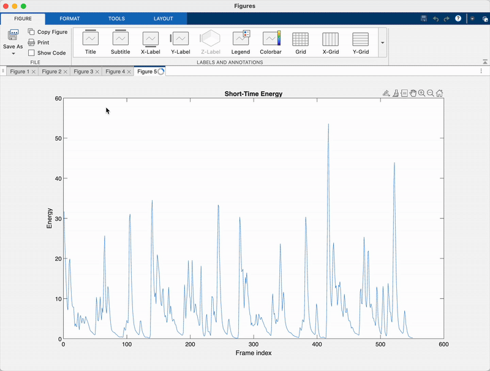

# AudioFeatureExplorer_MATLAB — Multi-Feature Audio Analysis Tool


AudioFeatureExplorer_MATLAB is a MATLAB project that extracts and visualizes multiple time-varying audio features using the Audio Toolbox.  
The script computes frame-based metrics such as spectral centroid, spectral flux, zero-crossing rate, short-time energy, and linear spectrum, and plots each feature across time for detailed analysis.

---

## Features Extracted
- **Linear Spectrum**
- **Spectral Centroid**
- **Spectral Flux**
- **Zero-Crossing Rate**
- **Short-Time Energy**

Each feature is processed over overlapping frames using a periodic Hann window for accurate STFT-based analysis.

---

## Repository Contents
| File | Description |
|------|-------------|
| `myExtractor.m` | Main MATLAB function — extracts feature matrix & feature index struct |
| `plot_AudioFeatureExplorer.m` | Example script used to run extraction and generate plots |
| `img/LinearSpectrum.png` | Plot of linear magnitude spectrum across time |
| `img/SpectralCentroid.png` | Plot of spectral centroid |
| `img/SpectralFlux.png` | Plot of spectral flux |
| `img/ZeroCrossRate.png` | Plot of zero-crossing rate |
| `img/ShortTimeEnergy.png` | Plot of short-time energy |

---

## How to Use

### 1. Set audio file and parameters
Inside `plot_AudioFeatureExplorer.m`:
```matlab
fileName = "MelodyLoop.wav";
N = 4096;
hop = 1024;
```

### 2. Extract features
[featureData, featureIndices] = myExtractor(fileName, N, hop);

### 3. Plot features
plot(featureData(featureIndices.spectralCentroid, :));
title('Spectral Centroid');

---

## myExtractor Function Call
[featureData, featureIndices] = myExtractor(audioFileName, frameLength, hop);

---

## Technical Notes
- Extractor is built using MATLAB Audio Toolbox functions:
  - `audioFeatureExtractor()`
  - `extract()`
  - `info()`
- Frame processing uses:
  - `frameLength = N`
  - `hopSize = hop`
  - `OverlapLength = frameLength - hop`
- A **periodic Hann window** is applied before extraction for STFT-style analysis
- Extracted feature matrix is transposed so that:
  - **Rows = features**
  - **Columns = frames**
- Compatible with mono `.wav` files by default
  - Stereo input is automatically downmixed internally by `audioFeatureExtractor`
 
---

## Engineering Relevance
This project demonstrates DSP and feature-engineering techniques used in modern audio research and production systems:

- Time-frequency analysis using frame-based extraction
- Spectral and temporal feature computation for audio characterization
- Feature vector organization suitable for machine learning pipelines
- Visualization of feature evolution across time for signal interpretation

These methods form the basis of:
- Music Information Retrieval (MIR)
- Beat and onset detection
- Audio classification and tagging models
- Dataset creation for deep learning on audio
- Adaptive DSP and content-aware audio systems

---

## Example Output (Included in /img/)
| Feature | Example Plot |
|---------|--------------|
| Linear Spectrum | `img/LinearSpectrum.png` |
| Spectral Centroid | `img/SpectralCentroid.png` |
| Spectral Flux | `img/SpectralFlux.png` |
| Zero-Crossing Rate | `img/ZeroCrossRate.png` |
| Short-Time Energy | `img/ShortTimeEnergy.png` |
Each plot demonstrates how the feature evolves across time, enabling visual inspection of audio behavior without running a DAW or real-time analyzer.

---

### Real-Time Animated Feature Visualization

<p align="center">
  
</p>
The animated visualization shows how each feature evolves over time while the audio file is processed frame-by-frame, providing a real-time view of spectral and temporal changes.

### Why this matters
Real-time analysis like this is valuable in:
- Machine-learning feature engineering
- Music information retrieval (MIR)
- Beat and onset detection systems
- Adaptive DSP and effects automation
- Dataset creation for deep learning on audio
- Interactive audio / game-audio systems
---

## Requirements
- **MATLAB R2023b or later**
- **Audio Toolbox** installed and licensed
- Compatible with macOS and Windows
- Tested with:
  - Frame length `N = 4096`
  - Hop size `hop = 1024`
  - Mono `.wav` input at 44.1 kHz
- At least 8 GB RAM recommended for smooth feature visualization when using large audio files

---

## Real-World Applications
AudioFeatureExplorer_MATLAB models techniques used in:

- Automatic speech/music classification
- MIR (Music Information Retrieval)
- Beat and onset tracking
- Deep-learning dataset feature generation
- Adaptive DSP systems and content-aware effects
- Emotion, genre, and spectral-profile recognition

© Henry Powell — MATLAB & Audio DSP Development
 
    
